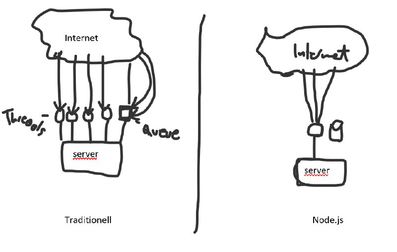

# NODE.js Mitschrift
- Traditionell:  
 wird der Server über Threads kontaktiert. Das ist für REST Webseiten, bei denen durchgehend irgendwelche kleine Abfragen gemacht werden tötlich, da für jede Abfrage immer der Thread blockiert wird.
 - Node.js:  
 Es gibt nur einen Thread. In diesem Thread ist eine kleine Queue drinnen, die nacheinander abgearbeitet wird. Alle Anfragen gelangen zu dem Thread.  
 Dieser Thread arbeitet __parallel__ die Tasks ab.  
 __Vorteile__: wenig RAM nötig, nur ein Thread

 Aktueller JavaScript Standard: es6
#### Variablen Deklarierung
Variablen müssen mit "var" deklariert werden. Ansonsten sind sie global. Wenn man dann in zwei verschiedenen Files die selbe Variable hat überschreiben sie sich. -> Man kann viel Blödsinn damit anstellen.

#### Verschiedene Funktionsdefinitionen:

    function add5(x){
	    return x+5
    }

    var add10 = function(x){
        return x+10
    }

    var add15 = (x) => {
        return x+15
    }

    function execute(fun, wert){
        console.log("Ergebnis:"+fun(wert))
    }

### Verschiedene Commands
__Datei aus Filesystem einlesen:__  
Mit require lädt man eine Library und weist sie einer Variable zu.

    const fs = require('fs')
Mit __Callbacks__ können solche Aufrufe dann gemacht werden, damit sie den Thread nicht blockieren.  

    fs.readFile('Hello.txt', (err,data) => {
        if(err) throw exception
        console.log(data.toString())
    })

## Node Package Manager (npm)

    npm init
    npm install --save express